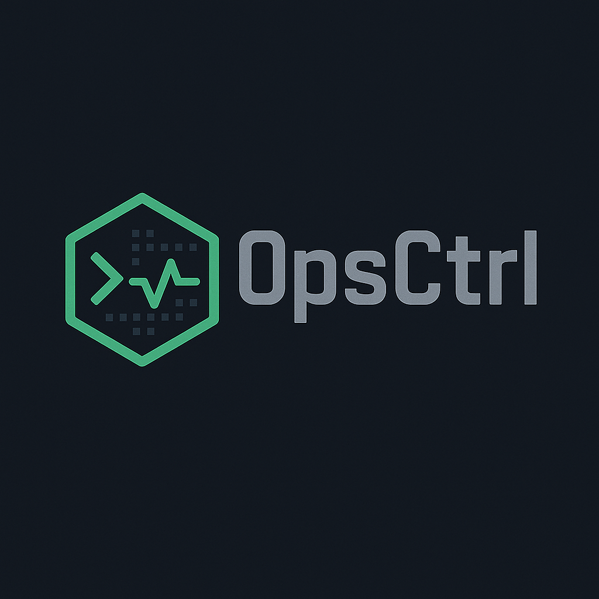

<p align="center">
  
</p>

> Diagnose Kubernetes pod failures in seconds—directly from your terminal.

# Opsctrl CLI

Opsctrl CLI is an open-source command-line interface for DevOps and platform engineers. It enables rapid, intelligent diagnosis of Kubernetes pod issues by analyzing logs, events, and AI-powered insights.

**Note:** This CLI is part of the broader **Opsctrl** platform. While the CLI itself is open source, the full SaaS offering provides incident history, audit trails, Slack integrations, and team dashboards.

If you find this tool valuable, please consider [starring the repository](https://github.com/Hillyon-Labs/opsctrl_cli) to support ongoing development.

---

## Features

- Diagnose pod issues using logs and event data
- Receive AI-powered suggestions and explanations
- Automatically record incidents in the Opsctrl backend
- Authenticate via `opsctrl login` (device code flow)
- Integrates seamlessly with existing Kubernetes contexts

---

## Current Status

- `opsctrl login` — fully functional
- `opsctrl diagnose` — fully functional
- AI-powered diagnostics — integrated
- `opsctrl fix` — coming in v0.2
- Slack integration — planned

---

## Quick Start

### Install via npm (Windows users recommended)

```bash
npm install -g opsctrl
```

### Install via GitHub Releases

```bash
curl -sSL https://opsctrl.dev/install.sh | bash
```

The script will download and install the latest binary for your platform.

---

## Commands

### `opsctrl login`

Initiate authentication with the Opsctrl Cloud service. Implements a device code flow similar to Azure CLI or GitHub CLI.

### `opsctrl diagnose <pod-name> --namespace <namespace>`

Collect logs and event data for the specified pod and submit them for AI-powered analysis.

```bash
opsctrl diagnose nginx-crash --namespace dev
```

### `opsctrl fix <pod-name>` _(planned for v0.2)_

Preview or apply automated remediation suggestions.

---

## Authentication

- Credentials are stored securely in `~/.opsctrl/credentials.json`
- Tokens are JWTs issued by the Opsctrl backend
- All CLI commands automatically include the authentication token

---

## Roadmap

- [x] CLI installation and login
- [x] Log and event collection
- [x] AI-powered diagnostics
- [ ] Automated remediation (`opsctrl fix`)
- [ ] Slack notifications
- [ ] Web-based team dashboard

Contributions are welcome. To participate, please [open an issue](https://github.com/Hillyon-Labs/opsctrl_cli/issues) or submit a pull request.

---

## Contributing

This project is open to community contributions under a non-commercial license. Feel free to report issues, propose features, or contribute code.

---

## About

Opsctrl CLI is maintained by Hillyon Labs. Designed to be secure, extensible, and composable for real-world DevOps workflows.

For access to the complete Opsctrl Cloud platform, including incident history, audit trails, Slack integration, and team dashboards, visit [https://opsctrl.dev](https://opsctrl.dev).

---

## Contact

- Email: [hello@opsctrl.dev](mailto:hello@opsctrl.dev)
- Twitter: [@opsctrl](https://twitter.com/opsctrl)
- Website: [https://opsctrl.dev](https://opsctrl.dev)

---

## License

This software is licensed under the terms described in [LICENSE](./LICENSE).

© 2025 Hillyon Labs
